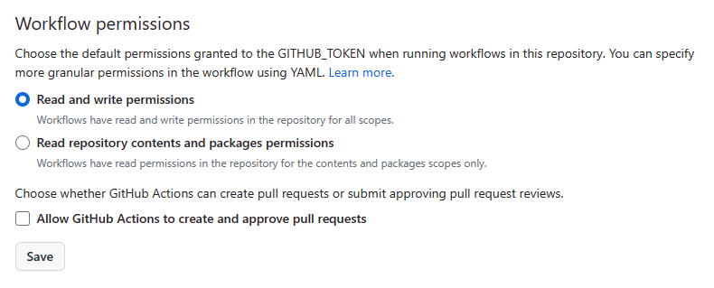
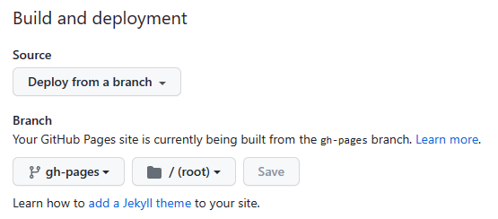
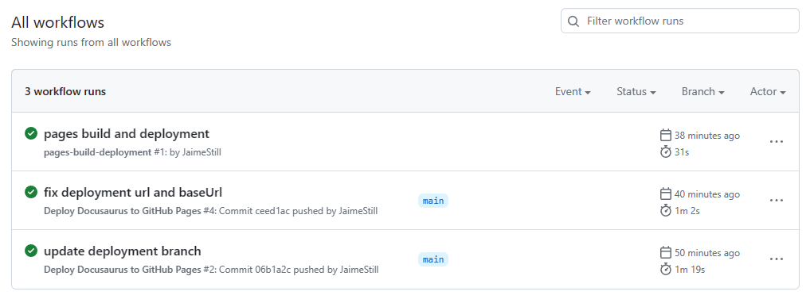
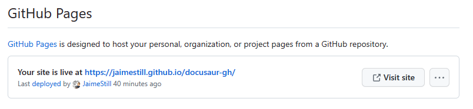
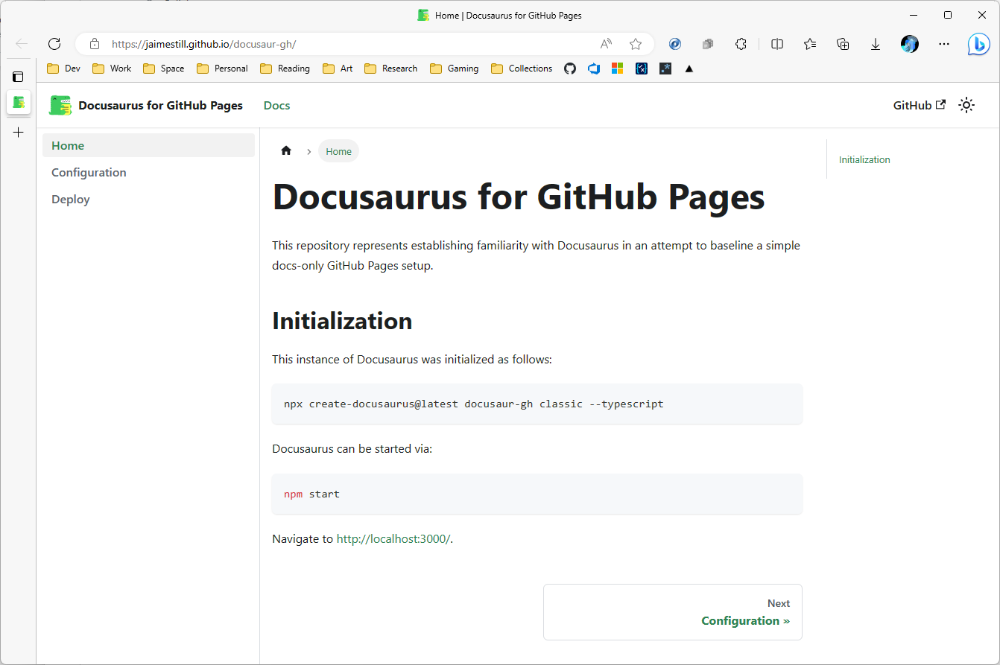

# Deploy Docusaurus to GitHub Pages

:::caution

Ensure that [docusaurus.config.js](../docusaurus.config.js) is correctly configured as outlined in the [Configuration](./config#configure) guide.

:::

## Configure GitHub Repository

In the corresponding GitHub repository, the `github-actions[bot]` user will need the appropriate **Actions** permissions. 

1. Navigate to `https://github.com/<org-or-user>/<repo>/settings/actions`.

2. In the **Workflow permissions** section, check *Read and write permissions* and click **Save**:

    

Additionally, the repository needs to be configured to enable GitHub Pages.

1. Navigate to `https://github.com/<org-or-user>/<repo>/settings/pages`.

2. Set **Source** to *Deploy from a branch*.

3. Set **Branch** to `gh-pages` at `/(root)` and click **Save**:

    

## GitHub Actions Workflow

Create the following GitHub Actions workflow in `.github/workflows`:

```yml title=".github/workflows/deploy-docs.yml"
name: Deploy Docusaurus to GitHub Pages

on:
  push:
    paths-ignore:
      - 'README.md'
    branches:
      - main

jobs:
  deploy:
    name: Deploy to GitHub Pages
    runs-on: ubuntu-latest
    defaults:
      run:
        working-directory: .
    steps:
      - uses: actions/checkout@v3
      - uses: actions/setup-node@v3
        with:
          node-version: 18
          cache: npm

      - name: Install dependencies
        run: npm ci
      - name: Build website
        run: npm run build

      - name: Deploy to GitHub Pages
        uses: peaceiris/actions-gh-pages@v3
        with:
          github_token: ${{ secrets.GITHUB_TOKEN }}
          publish_dir: ./build
          # The following lines assign commit authorship to the official
          # GH-Actions bot for deploys to `gh-pages` branch:
          # https://github.com/actions/checkout/issues/13#issuecomment-724415212
          # The GH actions bot is used by default if you didn't specify the two fields.
          # You can swap them out with your own user credentials.
          user_name: github-actions[bot]
          user_email: 41898282+github-actions[bot]@users.noreply.github.com
```

Push the changes up to the remote repository, and verify that the action runs successfully at `https://github.com/<org-or-user>/<repo>/actions`:



Once successful, you should see the following in the GitHub Pages settings for the repo:



Click **Visit Site** to see the hosted documentation:


